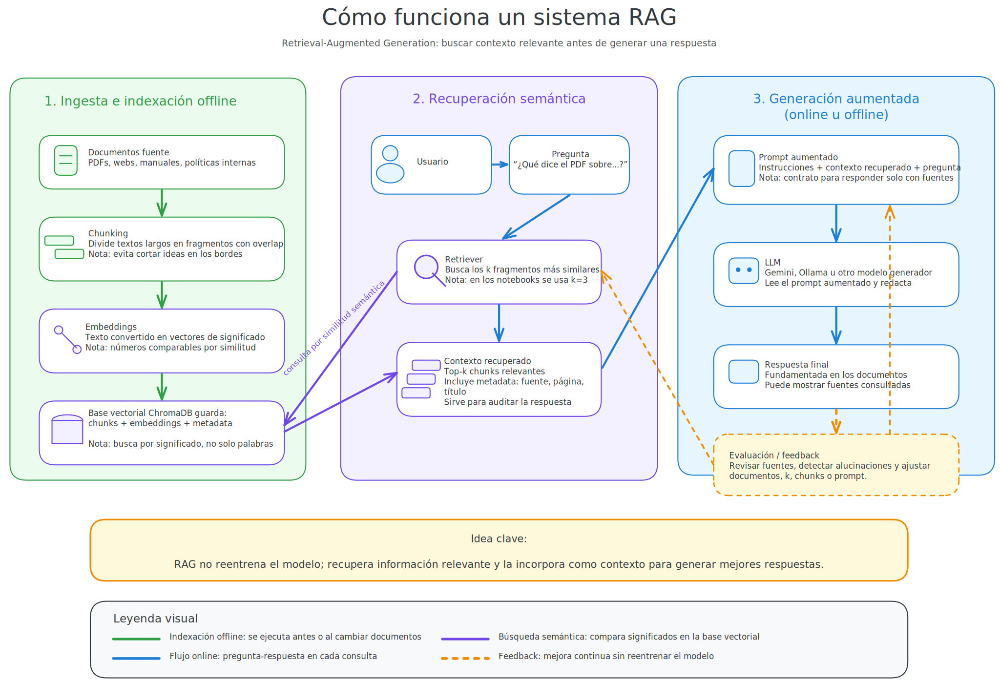

# Unidad 014 — APIs, LLMs Locales y RAG

**Tecnicatura Superior en Ciencias de Datos e IA — IFTS24**  
Laboratorio de Procesamiento del Lenguaje Natural · Matías Barreto, 2026

Colección de notebooks sobre el uso de APIs de modelos de lenguaje grandes (OpenAI, Gemini), configuración y despliegue de LLMs locales con Ollama, extracción estructurada con Pydantic orientada a humanidades digitales, procesamiento de documentos, bases de datos vectoriales con ChromaDB y desarrollo de sistemas RAG (Retrieval-Augmented Generation) completos integrando LangChain.



---

## Contenido

| Notebook | Tema |
|---|---|
| `01_actualizacion_informacion_llms` | Actualización de información en LLMs: agentes sencillos de búsqueda externa usando SerpAPI y OpenAI |
| `02_carga_documentos_rag` | Carga de documentos: procesamiento, carga y partición de PDFs y páginas web con LangChain |
| `03_bases_datos_vectoriales_chromadb` | Almacenamiento vectorial: inicialización, persistencia, consulta y embeddings con ChromaDB |
| `04_sistema_rag_completo_gemini` | Implementación de un pipeline RAG completo usando LangChain, Chroma y la API de Gemini (con opción local) |
| `05_ollama_llms_locales` | Introducción a LLMs locales: configuración, ejecución e interfaz gráfica con Gradio usando Ollama |
| `06_modelos_locales_pydantic_humanidades` | Extracción estructurada de información con Pydantic, grafos relacionales y visualización |
| `07_proyecto_final_rag_gradio` | Proyecto integrador: RAG local completo con interfaz de usuario en Gradio y preparación de archivos (`app.py`, `requirements.txt`) para su despliegue en HuggingFace Spaces |
| `08_BONUS_A_B_testing` | Experimento de A/B testing para evaluar la efectividad de estrategias de prompting (zero-shot vs. few-shot) con interfaz de evaluación humana ciega usando ipywidgets y análisis estadístico |

---

## Cómo descargar esta carpeta

Esta es una subcarpeta dentro de un repositorio más grande. Para descargarla sola, sin clonar todo el repositorio, hay dos herramientas web gratuitas que no requieren registro:

### Opción 1 — Download Directory

Una de las opciones más limpias y directas:

1. Copiá el enlace completo de esta carpeta en GitHub.
2. Entrá en **[download-directory.github.io](https://download-directory.github.io)**.
3. Pegá la URL en el cuadro de búsqueda y presioná Enter.
4. Se va a descargar automáticamente un archivo `.zip` con únicamente esta carpeta y todos sus archivos.

### Opción 2 — DownGit

Alternativa clásica y muy confiable:

1. Entrá en **[downgit.github.io](https://downgit.github.io)**.
2. Pegá el enlace de la carpeta en el campo que dice *GitHub URL*.
3. Hacé clic en el botón **Download**.

---

## Configuración del entorno local

### Requisitos previos

- **Python 3.10 o superior** — [python.org/downloads](https://www.python.org/downloads/)
- **uv** — gestor de entornos virtuales ultrarrápido
- **Ollama** — requerido para ejecutar los modelos locales de la unidad — [ollama.com](https://ollama.com)

### Pasos para configurar el entorno

1. **Crear el entorno virtual** e instalar las dependencias con `uv`:
   ```bash
   # Crear entorno virtual .venv
   uv venv

   # Activar el entorno virtual
   # En macOS/Linux:
   source .venv/bin/activate
   # En Windows:
   .venv\Scripts\activate

   # Instalar las dependencias específicas de esta unidad
   uv pip install -r requirements.txt
   ```

### Configuración de API keys

Este proyecto usa variables de entorno para manejar claves de APIs externas.

1. Copiá el archivo de ejemplo:

   ```bash
   cp .env.example .env
   ```

2. Editá `.env` y completá tus claves:

   ```
   OPENAI_API_KEY=tu_clave_de_openai
   GOOGLE_API_KEY=tu_clave_de_google
   GEMINI_API_KEY=tu_clave_de_gemini
   SERPAPI_API_KEY=tu_clave_de_serpapi
   ```

3. No subas `.env` al repositorio. Ese archivo contiene secretos locales.
